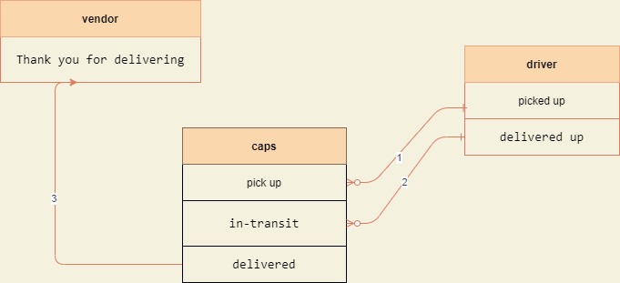

# caps

**CAPS Phase 1:** Begin the build of an application for a company called CAPS - The Code Academy Parcel Service. In this sprint, we’ll build out a system that emulates a real world supply chain. CAPS will simulate a delivery service where vendors (such a flower shops) will ship products using our delivery service and when our drivers deliver them, be notified that their customers received what they purchased.
---------------------------

### Test
run node caps.js to see the output in your terminal

what expext to see:

>EVENT, {event: pickup
time: Sun Aug 22 2021 16:08:30 GMT+0300 (Eastern European Summer Time)
payload: {
  storeName: 'flower shop',
  orderId: 'f3552b0e-c565-4c1e-aa69-3de5e6d084d8',
  customerName: 'Earl Cronin',
  address: '084 Davis Ramp'
}
DRIVER: picked up f3552b0e-c565-4c1e-aa69-3de5e6d084d8
EVENT, {event: 'in-transit
time: Sun Aug 22 2021 16:08:31 GMT+0300 (Eastern European Summer Time)
payload: {
  storeName: 'flower shop',
  orderId: 'f3552b0e-c565-4c1e-aa69-3de5e6d084d8',
  customerName: 'Earl Cronin',
  address: '084 Davis Ramp'
}
DRIVER: delivered up f3552b0e-c565-4c1e-aa69-3de5e6d084d8
VENDOR: Thank you for delivering f3552b0e-c565-4c1e-aa69-3de5e6d084d8
EVENT, {event: 'delivered
time: Sun Aug 22 2021 16:08:34 GMT+0300 (Eastern European Summer Time)
payload: {
  storeName: 'flower shop',
  orderId: 'f3552b0e-c565-4c1e-aa69-3de5e6d084d8',
  customerName: 'Earl Cronin',
  address: '084 Davis Ramp'
}

------------------------

### UML 

