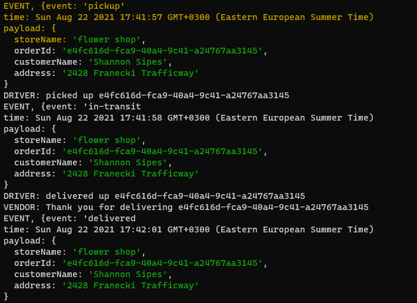
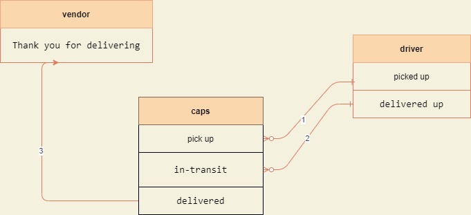

# caps

**CAPS Phase 1:** 

Begin the build of an application for a company called CAPS - The Code Academy Parcel Service. In this sprint, we’ll build out a system that emulates a real world supply chain. CAPS will simulate a delivery service where vendors (such a flower shops) will ship products using our delivery service and when our drivers deliver them, be notified that their customers received what they purchased.

---------------------------

**CAPS Phase 2:**
Continue working on a multi-day build of our delivery tracking system, moving event management to socket.io

In this phase, we’ll be moving away from using TCP for our event network and switching instead in to using socket.io, which takes on some of the complexity we had to manage ourselves, and also works equally well between servers and with websites.

-----------------

### Test

run <code>node caps.js</code> to see the output in your terminal

**what expext to see:**

------------------------

### UML 

